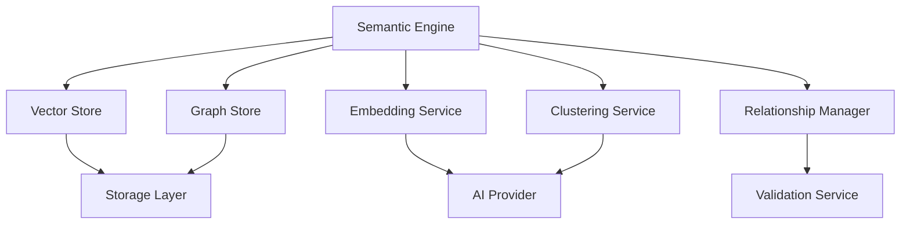
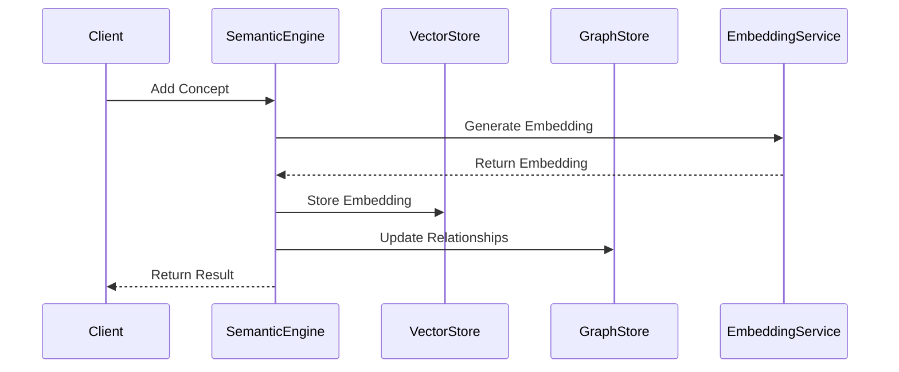

# Semantic Implementation Architecture

## System Components

### 1. Core Components



### 2. Data Flow



## Implementation Details

### 1. Core Services

```typescript
// Semantic Engine
class SemanticEngine {
  private vectorStore: VectorStore;
  private graphStore: GraphStore;
  private embeddingService: EmbeddingService;
  private clusteringService: ClusteringService;
  private relationshipManager: RelationshipManager;

  async addConcept(concept: Concept): Promise<void> {
    const embedding = await this.embeddingService.generateEmbedding(concept);
    await this.vectorStore.store(concept.id, embedding);
    await this.relationshipManager.updateRelationships(concept);
  }

  async findRelated(concept: Concept): Promise<Concept[]> {
    const embedding = await this.embeddingService.generateEmbedding(concept);
    const similar = await this.vectorStore.findSimilar(embedding);
    return this.relationshipManager.getRelatedConcepts(similar);
  }
}

// Vector Store
class VectorStore {
  private store: VectorDatabase;
  
  async store(id: string, embedding: number[]): Promise<void> {
    await this.store.insert({ id, embedding });
  }
  
  async findSimilar(embedding: number[]): Promise<string[]> {
    return this.store.query(embedding, { limit: 10 });
  }
}

// Graph Store
class GraphStore {
  private store: GraphDatabase;
  
  async addRelationship(relationship: Relationship): Promise<void> {
    await this.store.createRelationship(relationship);
  }
  
  async getRelationships(conceptId: string): Promise<Relationship[]> {
    return this.store.getRelationships(conceptId);
  }
}
```

### 2. Configuration

```yaml
semantic:
  engine:
    vector_store:
      type: "pinecone"
      dimensions: 1536
      index: "concepts"
    
    graph_store:
      type: "neo4j"
      uri: "bolt://localhost:7687"
      database: "semantic"
    
    embedding:
      provider: "openai"
      model: "text-embedding-ada-002"
      dimensions: 1536
    
    clustering:
      algorithm: "hdbscan"
      min_cluster_size: 5
      min_samples: 3
```

### 3. Integration Points

```typescript
// Plugin Interface
interface SemanticPlugin {
  // Core Methods
  processConcept(concept: Concept): Promise<void>;
  updateRelationships(concept: Concept): Promise<void>;
  
  // Configuration
  getConfiguration(): PluginConfiguration;
  validateConfiguration(config: PluginConfiguration): boolean;
}

// API Endpoints
interface SemanticAPI {
  // Concept Management
  addConcept(concept: Concept): Promise<void>;
  getConcept(id: string): Promise<Concept>;
  findRelated(id: string): Promise<Concept[]>;
  
  // Relationship Management
  addRelationship(relationship: Relationship): Promise<void>;
  getRelationships(id: string): Promise<Relationship[]>;
  
  // Cluster Management
  createCluster(concepts: Concept[]): Promise<Cluster>;
  getCluster(id: string): Promise<Cluster>;
  mergeClusters(ids: string[]): Promise<Cluster>;
}
```

## Usage Examples

### 1. Adding a Concept

```typescript
// Create concept
const concept = {
  id: "concept-1",
  type: "document",
  content: "Example content",
  metadata: {
    author: "John Doe",
    created: new Date()
  }
};

// Add to semantic engine
await semanticEngine.addConcept(concept);

// Find related concepts
const related = await semanticEngine.findRelated(concept);
```

### 2. Managing Relationships

```typescript
// Create relationship
const relationship = {
  id: "rel-1",
  type: "references",
  source: "concept-1",
  target: "concept-2",
  strength: 0.8,
  confidence: 0.9
};

// Add relationship
await semanticEngine.addRelationship(relationship);

// Get relationships
const relationships = await semanticEngine.getRelationships("concept-1");
```

### 3. Clustering Concepts

```typescript
// Create cluster
const cluster = await semanticEngine.createCluster([
  concept1,
  concept2,
  concept3
]);

// Merge clusters
const merged = await semanticEngine.mergeClusters([
  cluster1.id,
  cluster2.id
]);
```

## References

- [Semantic Clustering Standards](../standards/semantic-clustering.md)
- [Agentic Orchestration Layer](./agentic-orchestration.md)
- [System Overview](./system-overview.md)

---

*This implementation provides a robust foundation for semantic clustering and relationship management in the system.* 