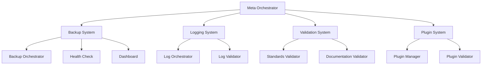
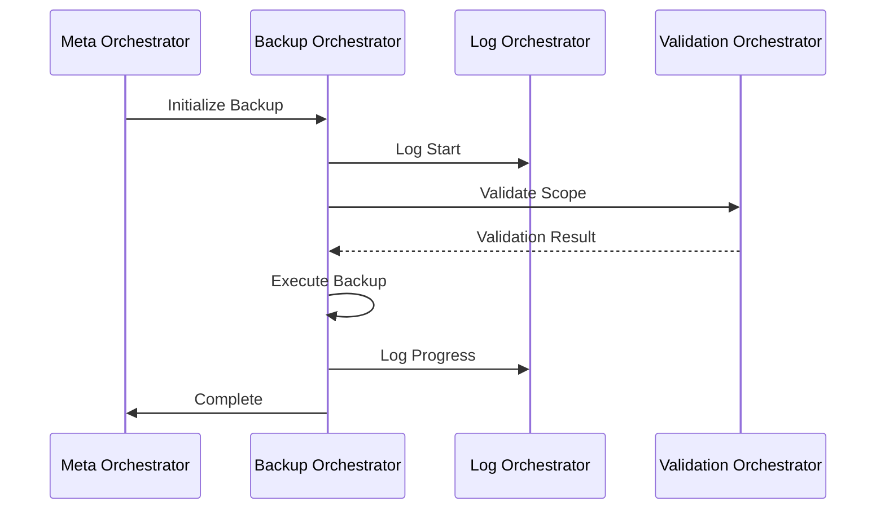

# System Overview

## Core Architecture

### 1. System Components



### 2. Component Interactions

#### 2.1 Core Flow
1. Meta Orchestrator initializes all systems
2. Each system registers with Meta Orchestrator
3. Systems communicate through defined interfaces
4. All operations are logged and validated
5. State changes trigger appropriate workflows

#### 2.2 Backup Flow


## System Features

### 1. Self-Healing
- Automatic directory creation
- File integrity verification
- Error recovery
- State restoration
- Health monitoring

### 2. Documentation
- Living documentation
- AI-friendly formatting
- Automated validation
- Version tracking
- Cross-referencing

### 3. Plugin System
- Standardized interfaces
- Version management
- Dependency tracking
- Testing requirements
- Documentation requirements

### 4. Workflow Management
- Declarative definitions
- State management
- Error handling
- Monitoring
- Recovery

## Integration Points

### 1. API Layer
```typescript
interface SystemAPI {
  // Core Operations
  initialize(): Promise<void>;
  shutdown(): Promise<void>;
  getStatus(): Promise<SystemStatus>;
  
  // Backup Operations
  backup(options: BackupOptions): Promise<BackupResult>;
  restore(options: RestoreOptions): Promise<RestoreResult>;
  
  // Plugin Operations
  installPlugin(plugin: Plugin): Promise<void>;
  uninstallPlugin(pluginId: string): Promise<void>;
  
  // Workflow Operations
  executeWorkflow(workflow: Workflow): Promise<WorkflowResult>;
  getWorkflowStatus(workflowId: string): Promise<WorkflowStatus>;
}
```

### 2. Plugin Interface
```typescript
interface Plugin {
  // Plugin Metadata
  id: string;
  name: string;
  version: string;
  description: string;
  
  // Plugin Lifecycle
  initialize(): Promise<void>;
  shutdown(): Promise<void>;
  
  // Plugin Operations
  executeTask(task: Task): Promise<TaskResult>;
  validateTask(task: Task): Promise<ValidationResult>;
  
  // Plugin Events
  onTaskComplete: (result: TaskResult) => void;
  onTaskError: (error: Error) => void;
}
```

## Configuration

### 1. System Configuration
```yaml
system:
  name: "CLARITY_ENGINE"
  version: "1.0.0"
  environment: "production"
  
  backup:
    retention: 5
    schedule: "0 0 * * *"
    scope: "full"
    
  logging:
    level: "info"
    format: "json"
    retention: "30d"
    
  validation:
    strict: true
    autoFix: true
    maxLineCount: 250
```

### 2. Workflow Configuration
```yaml
workflow:
  name: "backup-workflow"
  version: "1.0.0"
  
  triggers:
    - type: "schedule"
      cron: "0 0 * * *"
    
  steps:
    - name: "validate"
      type: "validation"
      config:
        scope: "full"
    
    - name: "backup"
      type: "backup"
      config:
        retention: 5
        scope: "full"
    
    - name: "verify"
      type: "verification"
      config:
        checks: ["integrity", "completeness"]
```

## Development Guidelines

### 1. Adding New Features
1. Create documentation
2. Write tests
3. Implement feature
4. Add validation
5. Update documentation
6. Submit PR

### 2. Plugin Development
1. Use plugin template
2. Follow standards
3. Write tests
4. Document API
5. Validate compliance
6. Submit PR

### 3. Documentation Updates
1. Update relevant docs
2. Add examples
3. Update references
4. Validate format
5. Submit PR

## References

- [Documentation Standards](../standards/documentation-standards.md)
- [Orchestration Standards](../standards/orchestration-standards.md)
- [Kernel Integration Standards](../standards/kernel-integration-standards.md)
- [Migration Plan](../standards/migration-plan.md)

---

*This overview provides a comprehensive understanding of the system architecture and interactions.* 