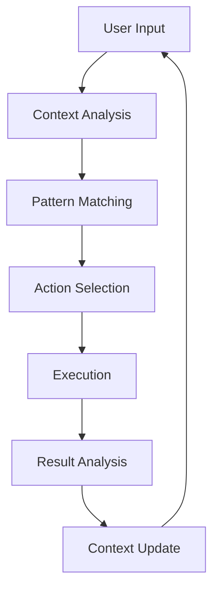
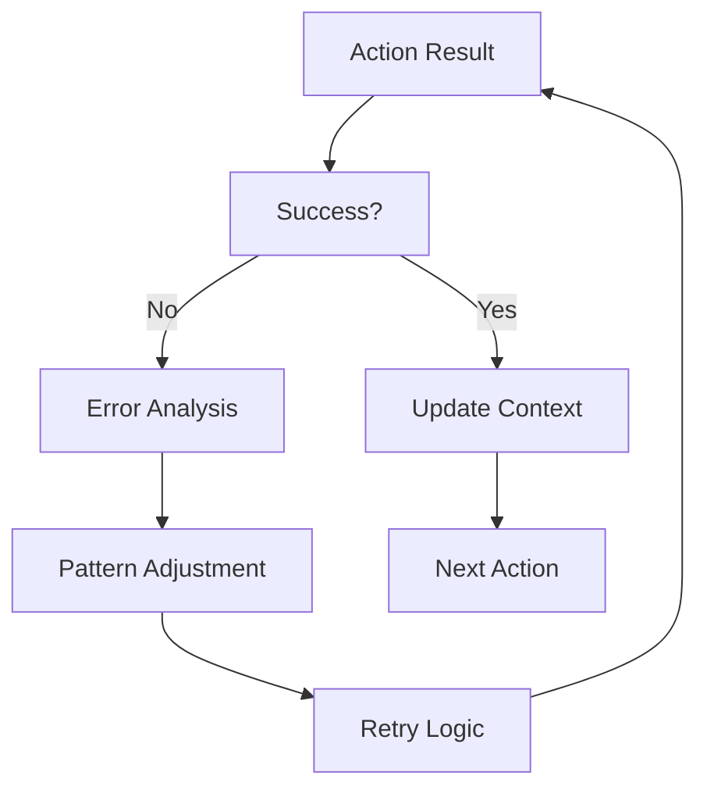
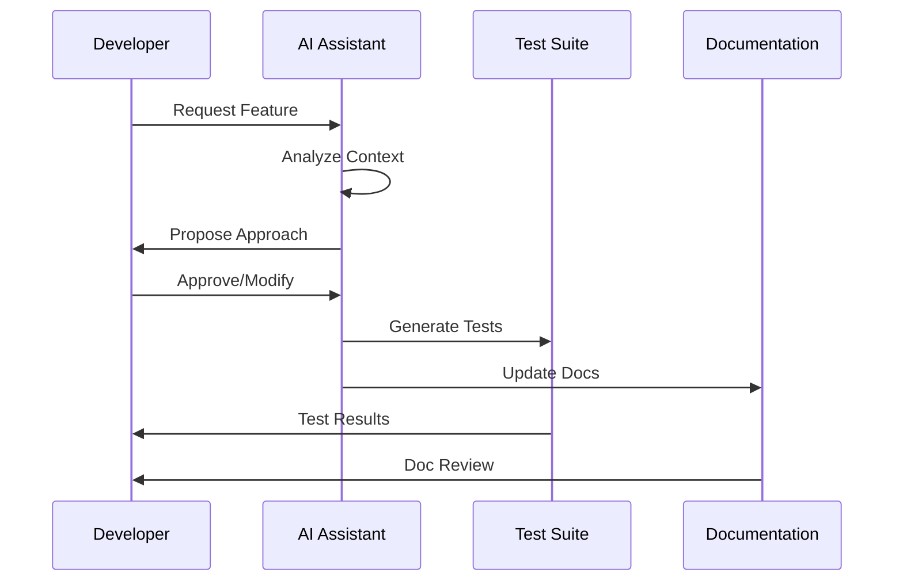
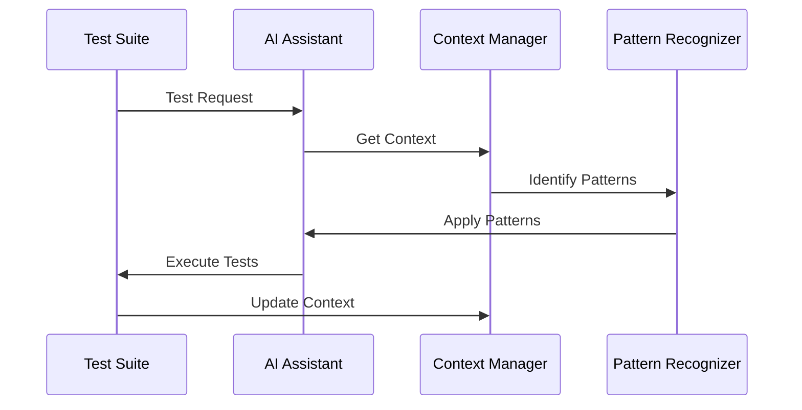

# AI Interaction Patterns

## Core Patterns

### 1. Context Preservation Loop


### 2. Feedback Integration


## Implementation Details

### 1. Context Management
```typescript
interface ContextManager {
  // Core Properties
  currentContext: Context;
  history: ContextHistory[];
  patterns: Pattern[];
  
  // Context Operations
  preserveContext(): Promise<void>;
  restoreContext(): Promise<void>;
  updateContext(change: ContextChange): Promise<void>;
  
  // Pattern Management
  identifyPatterns(): Promise<Pattern[]>;
  applyPatterns(context: Context): Promise<ActionResult>;
  
  // Learning
  learnFromInteraction(interaction: Interaction): Promise<void>;
  adaptToChanges(changes: Change[]): Promise<void>;
}
```

### 2. Pattern Recognition
```typescript
interface PatternRecognizer {
  // Pattern Types
  patterns: {
    development: DevelopmentPattern[];
    testing: TestingPattern[];
    documentation: DocumentationPattern[];
  };
  
  // Recognition
  identifyPatterns(context: Context): Promise<Pattern[]>;
  applyPatterns(patterns: Pattern[]): Promise<ActionResult>;
  
  // Learning
  learnNewPattern(pattern: Pattern): Promise<void>;
  adaptPatterns(changes: Change[]): Promise<void>;
}
```

### 3. Feedback Processing
```typescript
interface FeedbackProcessor {
  // Feedback Types
  feedback: {
    validation: ValidationFeedback[];
    learning: LearningFeedback[];
    adaptation: AdaptationFeedback[];
  };
  
  // Processing
  processFeedback(feedback: Feedback): Promise<void>;
  applyLearning(learning: Learning): Promise<void>;
  adaptPatterns(adaptation: Adaptation): Promise<void>;
}
```

## Usage Guidelines

### 1. Context Preservation
```yaml
context:
  preservation:
    - type: "conversation"
      storage: "thread_history"
      format: "structured"
      retention: "session"
    
    - type: "code"
      storage: "version_control"
      format: "diff"
      retention: "permanent"
    
    - type: "documentation"
      storage: "living_docs"
      format: "markdown"
      retention: "versioned"
```

### 2. Pattern Application
```yaml
patterns:
  application:
    - type: "development"
      trigger: "code_change"
      action: "validate"
      context: "preserve"
    
    - type: "testing"
      trigger: "test_run"
      action: "verify"
      context: "update"
    
    - type: "documentation"
      trigger: "doc_update"
      action: "validate"
      context: "preserve"
```

### 3. Feedback Integration
```yaml
feedback:
  integration:
    - type: "validation"
      trigger: "action_complete"
      action: "verify_result"
      recovery: "retry_with_context"
    
    - type: "learning"
      trigger: "pattern_identified"
      action: "update_knowledge"
      storage: "context_store"
    
    - type: "adaptation"
      trigger: "error_detected"
      action: "adjust_approach"
      context: "preserve_state"
```

## Best Practices

### 1. Context Management
- Always preserve context before actions
- Maintain context history
- Update context after changes
- Validate context integrity
- Clean up stale context

### 2. Pattern Recognition
- Identify common patterns
- Document pattern usage
- Validate pattern application
- Learn from pattern success
- Adapt patterns as needed

### 3. Feedback Processing
- Process all feedback
- Learn from feedback
- Adapt to feedback
- Preserve feedback history
- Validate adaptations

## Integration Points

### 1. Development Workflow


### 2. Testing Integration


## References

- [Kernel Philosophy](./kernel-philosophy.md)
- [Documentation Standards](./documentation-standards.md)
- [Kernel Integration Standards](./kernel-integration-standards.md)

---

*These patterns ensure robust, context-aware AI interactions throughout the system.* 