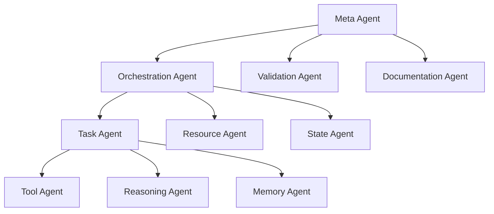

# Agentic Orchestration Layer

## Core Concepts

### 1. Cybernetic Principles
- Feedback loops and self-regulation
- System stability and adaptation
- Information processing and control
- Emergent behavior and complexity
- Hierarchical organization

### 2. Modern AI Integration
- Large Language Models (LLMs)
- Agent-based architectures
- Semantic understanding
- Context preservation
- Tool use and reasoning

### 3. Workflow Automation
- Declarative definitions
- State management
- Error handling
- Recovery procedures
- Monitoring and observability

## Architecture

### 1. Agent Hierarchy


### 2. Agent Types

#### 2.1 Meta Agent
- System-wide coordination
- Agent lifecycle management
- Resource allocation
- Conflict resolution
- Emergent behavior handling

#### 2.2 Orchestration Agent
- Workflow execution
- Task scheduling
- Resource management
- State transitions
- Error recovery

#### 2.3 Tool Agent
- Tool discovery
- Tool validation
- Tool execution
- Result verification
- Error handling

#### 2.4 Reasoning Agent
- Task decomposition
- Plan generation
- Constraint satisfaction
- Optimization
- Adaptation

#### 2.5 Memory Agent
- Context preservation
- State management
- Knowledge retrieval
- Pattern recognition
- Learning adaptation

## Implementation

### 1. Agent Interface
```typescript
interface Agent {
  // Core Properties
  id: string;
  type: AgentType;
  capabilities: Capability[];
  state: AgentState;
  
  // Lifecycle
  initialize(): Promise<void>;
  shutdown(): Promise<void>;
  
  // Operations
  perceive(context: Context): Promise<Perception>;
  reason(perception: Perception): Promise<Plan>;
  act(plan: Plan): Promise<ActionResult>;
  
  // Learning
  learn(experience: Experience): Promise<void>;
  adapt(change: Change): Promise<void>;
  
  // Communication
  communicate(message: Message): Promise<Response>;
  collaborate(agents: Agent[]): Promise<CollaborationResult>;
}
```

### 2. Tool Integration
```typescript
interface Tool {
  // Tool Metadata
  id: string;
  name: string;
  description: string;
  version: string;
  
  // Capabilities
  capabilities: Capability[];
  requirements: Requirement[];
  
  // Operations
  validate(input: Input): Promise<ValidationResult>;
  execute(input: Input): Promise<Output>;
  
  // Safety
  safetyChecks: SafetyCheck[];
  errorHandling: ErrorHandler[];
}
```

### 3. Memory System
```typescript
interface Memory {
  // Storage
  shortTerm: ShortTermMemory;
  longTerm: LongTermMemory;
  working: WorkingMemory;
  
  // Operations
  store(memory: MemoryItem): Promise<void>;
  retrieve(query: Query): Promise<MemoryItem[]>;
  update(memory: MemoryItem): Promise<void>;
  
  // Organization
  categorize(item: MemoryItem): Promise<Category[]>;
  relate(items: MemoryItem[]): Promise<Relation[]>;
}
```

## Cybernetic Integration

### 1. Feedback Loops
```yaml
feedback:
  type: "adaptive"
  components:
    - sensor: "performance"
      threshold: 0.8
      action: "optimize"
    
    - sensor: "error_rate"
      threshold: 0.1
      action: "recover"
    
    - sensor: "resource_usage"
      threshold: 0.9
      action: "scale"
```

### 2. Self-Regulation
```yaml
regulation:
  type: "homeostatic"
  systems:
    - name: "performance"
      target: 0.95
      tolerance: 0.05
      actions:
        - "optimize"
        - "scale"
        - "recover"
    
    - name: "stability"
      target: 0.99
      tolerance: 0.01
      actions:
        - "validate"
        - "verify"
        - "rollback"
```

## AI Integration

### 1. LLM Integration
```yaml
llm:
  provider: "openai"
  model: "gpt-4"
  capabilities:
    - "reasoning"
    - "planning"
    - "tool_use"
    - "memory"
  
  constraints:
    max_tokens: 4000
    temperature: 0.7
    top_p: 0.9
```

### 2. Tool Use
```yaml
tools:
  - name: "file_operations"
    capabilities:
      - "read"
      - "write"
      - "delete"
    safety:
      - "backup"
      - "verify"
  
  - name: "code_operations"
    capabilities:
      - "analyze"
      - "generate"
      - "refactor"
    safety:
      - "test"
      - "validate"
```

## Workflow Integration

### 1. Agent Workflow
```yaml
workflow:
  name: "agent_task"
  version: "1.0.0"
  
  agents:
    - type: "meta"
      role: "coordinator"
    
    - type: "orchestration"
      role: "executor"
    
    - type: "tool"
      role: "operator"
  
  steps:
    - name: "perceive"
      agent: "meta"
      action: "gather_context"
    
    - name: "reason"
      agent: "orchestration"
      action: "generate_plan"
    
    - name: "act"
      agent: "tool"
      action: "execute_tool"
```

## References

- [System Overview](./system-overview.md)
- [Orchestration Standards](../standards/orchestration-standards.md)
- [Documentation Standards](../standards/documentation-standards.md)
- [Cybernetics: Or Control and Communication in the Animal and the Machine](https://en.wikipedia.org/wiki/Cybernetics:_Or_Control_and_Communication_in_the_Animal_and_the_Machine)
- [The Society of Mind](https://en.wikipedia.org/wiki/The_Society_of_Mind)

---

*This framework combines cybernetics principles with modern AI practices to create a robust, adaptive, and intelligent orchestration system.* 