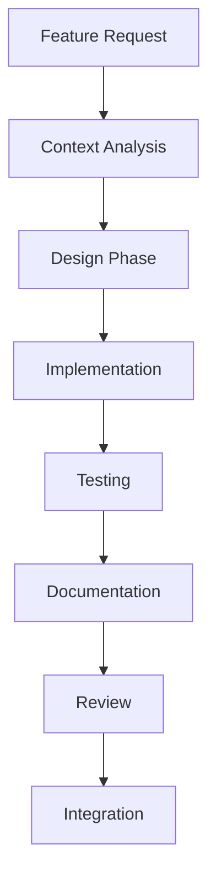
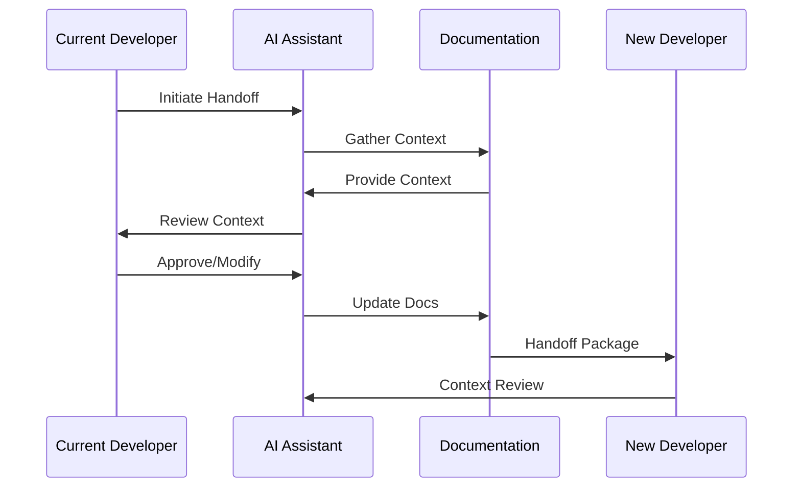
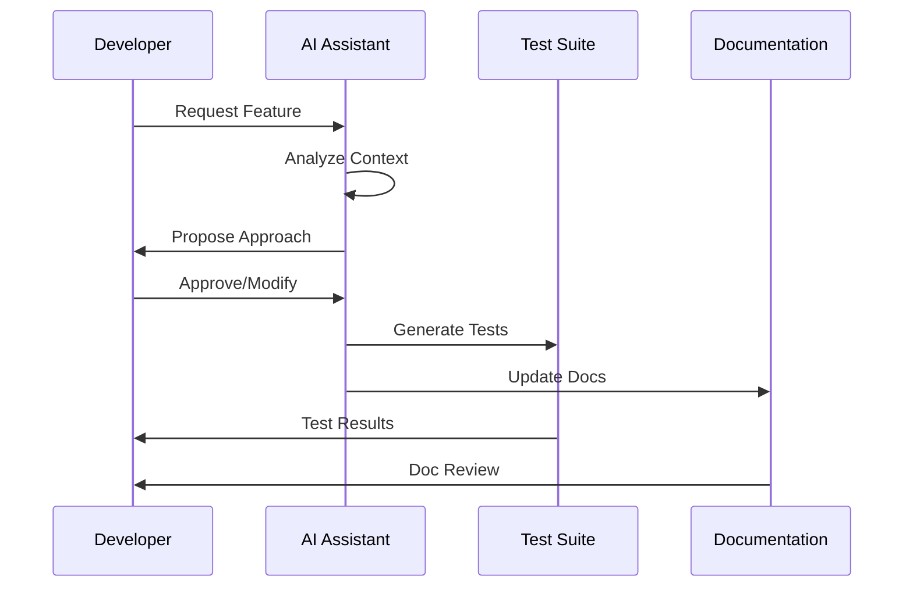
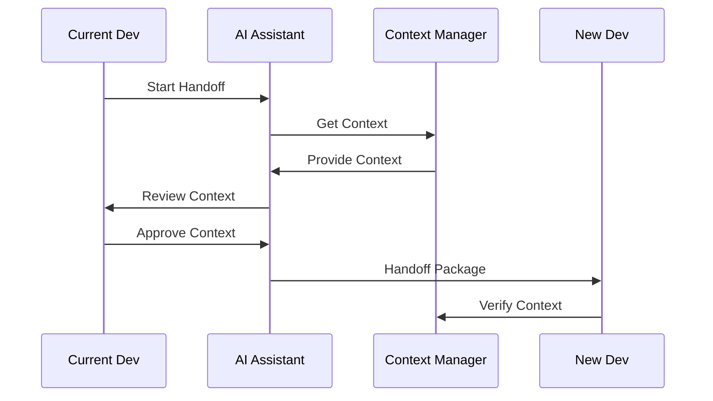

# Development Workflow

## Core Workflow

### 1. Feature Development


### 2. Handoff Process


## Implementation Details

### 1. Development Process
```typescript
interface DevelopmentProcess {
  // Core Properties
  currentPhase: Phase;
  context: DevelopmentContext;
  artifacts: Artifact[];
  
  // Process Management
  startPhase(phase: Phase): Promise<void>;
  completePhase(phase: Phase): Promise<void>;
  validatePhase(phase: Phase): Promise<ValidationResult>;
  
  // Artifact Management
  createArtifact(artifact: Artifact): Promise<void>;
  updateArtifact(artifact: Artifact): Promise<void>;
  validateArtifact(artifact: Artifact): Promise<ValidationResult>;
}
```

### 2. Handoff Management
```typescript
interface HandoffManager {
  // Core Properties
  currentContext: HandoffContext;
  history: HandoffHistory[];
  artifacts: HandoffArtifact[];
  
  // Handoff Operations
  prepareHandoff(): Promise<HandoffPackage>;
  validateHandoff(package: HandoffPackage): Promise<ValidationResult>;
  executeHandoff(package: HandoffPackage): Promise<void>;
  
  // Context Management
  preserveContext(): Promise<void>;
  restoreContext(): Promise<void>;
  updateContext(change: ContextChange): Promise<void>;
}
```

### 3. Documentation Process
```typescript
interface DocumentationProcess {
  // Core Properties
  currentDocs: Documentation[];
  history: DocumentationHistory[];
  validation: ValidationResult[];
  
  // Documentation Operations
  createDocumentation(doc: Documentation): Promise<void>;
  updateDocumentation(doc: Documentation): Promise<void>;
  validateDocumentation(doc: Documentation): Promise<ValidationResult>;
  
  // Context Integration
  integrateContext(context: Context): Promise<void>;
  validateContext(context: Context): Promise<ValidationResult>;
}
```

## Usage Guidelines

### 1. Development Workflow
```yaml
workflow:
  phases:
    - name: "analysis"
      steps:
        - "gather_requirements"
        - "analyze_context"
        - "design_solution"
    
    - name: "implementation"
      steps:
        - "write_code"
        - "write_tests"
        - "document_changes"
    
    - name: "review"
      steps:
        - "code_review"
        - "test_review"
        - "doc_review"
    
    - name: "integration"
      steps:
        - "merge_changes"
        - "verify_integration"
        - "update_docs"
```

### 2. Handoff Process
```yaml
handoff:
  preparation:
    - type: "context"
      action: "gather"
      format: "structured"
      validation: "required"
    
    - type: "documentation"
      action: "update"
      format: "markdown"
      validation: "required"
    
    - type: "artifacts"
      action: "package"
      format: "versioned"
      validation: "required"
```

### 3. Documentation Process
```yaml
documentation:
  process:
    - type: "code"
      format: "markdown"
      validation: "required"
      context: "preserve"
    
    - type: "api"
      format: "openapi"
      validation: "required"
      context: "preserve"
    
    - type: "workflow"
      format: "mermaid"
      validation: "required"
      context: "preserve"
```

## Best Practices

### 1. Development
- Follow clean slate philosophy
- Maintain test coverage
- Document everything
- Preserve context
- Validate changes

### 2. Handoff
- Prepare comprehensive handoff
- Validate all artifacts
- Preserve context
- Update documentation
- Verify handoff

### 3. Documentation
- Keep docs up to date
- Validate documentation
- Preserve context
- Cross-reference
- Version control

## Integration Points

### 1. Development Integration


### 2. Handoff Integration


## References

- [Kernel Philosophy](./kernel-philosophy.md)
- [AI Interaction Patterns](./ai-interaction-patterns.md)
- [Documentation Standards](./documentation-standards.md)

---

*This workflow ensures consistent, maintainable, and context-aware development and handoff processes.* 