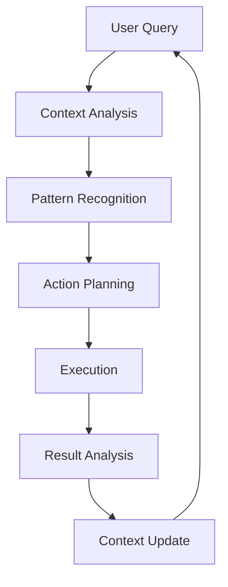
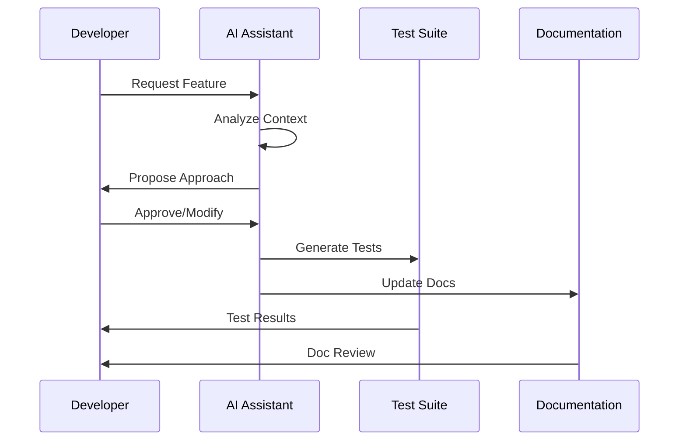

# Kernel Philosophy

## Core Principles

### 1. Clean Slate Foundation
- Start with minimal, proven components
- Remove all legacy and unused code
- Build up from a solid foundation
- Maintain E2E test coverage
- Document everything

### 2. Self-Healing Patterns
- Automatic directory creation
- File integrity verification
- Error recovery
- State restoration
- Health monitoring

### 3. Spiral-Out Development
- Start with core functionality
- Add features incrementally
- Maintain test coverage
- Document each addition
- Preserve system health

## AI Interaction Patterns

### 1. Context Preservation


### 2. Feedback Loops
```yaml
feedback:
  patterns:
    - type: "validation"
      trigger: "action_complete"
      action: "verify_result"
      recovery: "retry_with_context"
    
    - type: "learning"
      trigger: "pattern_identified"
      action: "update_knowledge"
      storage: "context_store"
    
    - type: "adaptation"
      trigger: "error_detected"
      action: "adjust_approach"
      context: "preserve_state"
```

### 3. Context Management
```typescript
interface ContextManager {
  // Core Properties
  currentContext: Context;
  history: ContextHistory[];
  patterns: Pattern[];
  
  // Operations
  preserveContext(): Promise<void>;
  restoreContext(): Promise<void>;
  updateContext(change: ContextChange): Promise<void>;
  
  // Pattern Management
  identifyPatterns(): Promise<Pattern[]>;
  applyPatterns(context: Context): Promise<ActionResult>;
  
  // Learning
  learnFromInteraction(interaction: Interaction): Promise<void>;
  adaptToChanges(changes: Change[]): Promise<void>;
}
```

## Development Workflow

### 1. Feature Addition


### 2. Context Preservation
```yaml
context:
  preservation:
    - type: "conversation"
      storage: "thread_history"
      format: "structured"
      retention: "session"
    
    - type: "code"
      storage: "version_control"
      format: "diff"
      retention: "permanent"
    
    - type: "documentation"
      storage: "living_docs"
      format: "markdown"
      retention: "versioned"
```

### 3. Pattern Recognition
```typescript
interface PatternRecognizer {
  // Pattern Types
  patterns: {
    development: DevelopmentPattern[];
    testing: TestingPattern[];
    documentation: DocumentationPattern[];
  };
  
  // Recognition
  identifyPatterns(context: Context): Promise<Pattern[]>;
  applyPatterns(patterns: Pattern[]): Promise<ActionResult>;
  
  // Learning
  learnNewPattern(pattern: Pattern): Promise<void>;
  adaptPatterns(changes: Change[]): Promise<void>;
}
```

## Implementation Guidelines

### 1. Code Structure
- Follow clean slate philosophy
- Implement self-healing
- Maintain test coverage
- Document everything
- Preserve context

### 2. Documentation
- Living documentation
- Context preservation
- Pattern documentation
- Test documentation
- Change tracking

### 3. Testing
- E2E test coverage
- Pattern validation
- Context verification
- Self-healing tests
- Integration tests

## References

- [Kernel Reset](../KERNEL_RESET.md)
- [Documentation Standards](./documentation-standards.md)
- [Kernel Integration Standards](./kernel-integration-standards.md)

---

*This philosophy ensures consistent, maintainable, and context-aware development of the kernel slate.* 