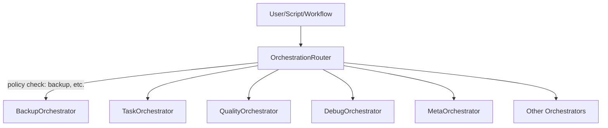

# Architecture Overview

The CLARITY_ENGINE kernel slate is designed for modularity, auditability, and continuous improvement.

## Key Principles
- Minimal, E2E-tested, self-healing kernel
- Modular spiral-out for new features
- Standards-driven docs and compliance
- Operator- and onboarding-friendly

## Main Components
- Backup and compliance orchestrators
- Modular `features/` directory for extensions
- Automated health, compliance, and doc validation

## Crosslinks
- [Kernel Standards](../KERNEL_SLATE/docs/standards/kernel-backup-e2e-checklist.md)
- [Modular Features](../features/README.md)

---
title: Architecture
description: Documentation for the architecture component of the Clarity Engine system.
lastUpdated: 2025-06-03T00:07:33.499Z
version: 1.0.0
tags: []
status: draft
---


# ClarityEngine System Architecture

## Overview

ClarityEngine is built on a modular, agent-based architecture that enables autonomous documentation generation and management. The system is designed to be scalable, maintainable, and extensible.

## Core Components

### 1. Engine Core
- **DocumentationManager**: Orchestrates the documentation generation process
- **FeatureAnalyzer**: Analyzes codebases to identify features and their relationships
- **ExportManager**: Handles documentation export in various formats
- **QualityController**: Ensures documentation quality and consistency

### 2. Agent System
- **QAResponder**: Handles documentation QA and validation
- **PromptArchitect**: Designs and optimizes documentation prompts
- **DevOpsAgent**: Manages deployment and infrastructure documentation
- **ExporterAgent**: Handles documentation export processes
- **BlessAgent**: Manages documentation approval workflows

### 3. API Layer
- RESTful API endpoints for all major operations
- Authentication and authorization
- Rate limiting and request validation
- WebSocket support for real-time updates

### 4. Frontend
- React-based single-page application
- Real-time documentation preview
- Export management interface
- User authentication and authorization

## Data Flow

1. **Feature Analysis**
   ```
   Codebase → FeatureAnalyzer → Feature Map → DocumentationManager
   ```

2. **Documentation Generation**
   ```
   Feature Map → PromptArchitect → Documentation Draft → QAResponder
   ```

3. **Export Process**
   ```
   Approved Docs → ExporterAgent → Export Formats → ExportManager
   ```

## Security Architecture

- **Authentication**: JWT-based authentication
- **Authorization**: Role-based access control
- **Data Protection**: Encryption at rest and in transit
- **Audit Logging**: Comprehensive activity logging

## Deployment Architecture

- **Development**: Local development environment
- **Staging**: Pre-production testing environment
- **Production**: High-availability production environment

## Integration Points

- **Version Control**: Git integration for documentation versioning
- **CI/CD**: Automated testing and deployment
- **Monitoring**: Health checks and performance monitoring
- **Logging**: Centralized logging system

## Scalability

- Horizontal scaling for API servers
- Load balancing for high availability
- Caching layer for improved performance
- Database sharding for large datasets

## Future Architecture

- Microservices architecture for better scalability
- Event-driven architecture for real-time updates
- Machine learning integration for smarter documentation
- Blockchain integration for documentation verification 
## Implementation

This section details the implementation specifics.


## Maintenance

This section covers maintenance and troubleshooting information.

## Orchestration and Backup Layer

The OrchestrationRouter is the canonical entry point for all orchestrator flows. It routes workflows and tasks to the appropriate orchestrator (Meta, Task, Quality, Debug, etc.), enforces backup and compliance policies via the BackupOrchestrator, and centralizes event routing, logging, and telemetry.

No destructive or system-altering operation may proceed without a valid, recent, and verified backup, enforced by the router and BackupOrchestrator.

See [ORCHESTRATION_ROUTER.md](./orchestration/ORCHESTRATION_ROUTER.md) and [backup-standards.md](./standards/backup-standards.md) for details.

### Router-Centric Architecture
```
[User/Script/Workflow]
        |
        v
[OrchestrationRouter] ---(policy check: backup, etc.)---> [BackupOrchestrator]
        |
        +--> [TaskOrchestrator]
        +--> [QualityOrchestrator]
        +--> [DebugOrchestrator]
        +--> [MetaOrchestrator]
        +--> [Other Orchestrators]
```

#### Mermaid Diagram


## Middleware Layer (Expanded)

The Middleware Layer is the first line of defense and compliance for all requests. It:
- Authenticates and authorizes users and projects (auth-middleware.js)
- Validates API keys (auth.js)
- Logs all access and security events (security-middleware.js)
- Injects user, project, and security context into orchestrator workflows
- Adds security headers and monitors for suspicious activity
- Can be extended with rate limiting, request validation, and global error handling

**Usage Example:**
```js
const authMiddleware = require('../middleware/auth-middleware');
const { requireKey } = require('../middleware/auth');
const securityMiddleware = require('../middleware/security-middleware');

app.use(authMiddleware);
app.use(requireKey);
app.use(securityMiddleware);
```

All middleware events are logged to LogOrchestrator, SecurityManager, and the conversation log for full auditability.

## Orchestration and Backup Layer (Expanded)

The OrchestrationRouter is the canonical entry point for all orchestrator flows. It:
- Routes workflows and tasks to the appropriate orchestrator (Meta, Task, Quality, Debug, etc.)
- Enforces backup and compliance policies via the BackupOrchestrator
- Centralizes event routing, logging, and telemetry
- Ensures no destructive or system-altering operation may proceed without a valid, recent, and verified backup
- Integrates with all middleware and standards

**Usage Example:**
```js
const OrchestrationRouter = require('./scripts/core/orchestration-router');
const router = new OrchestrationRouter(options);
await router.initialize();
await router.executeWorkflow('documentation', { ...params });
```

## System Safety and Recovery

- **BackupOrchestrator**: Ensures a valid backup exists before any destructive operation.
- **Restore and Rollback**: If a failure occurs, orchestrators can trigger a restore or rollback to the last good backup.
- **Audit Trail**: All actions, errors, and recoveries are logged to LogOrchestrator, TelemetryManager, and the conversation log.
- **E2E Testing**: All safety and recovery flows are covered by E2E tests, ensuring compliance and reliability.

See [backup-standards.md](./standards/backup-standards.md) and [ORCHESTRATION_ROUTER.md](./orchestration/ORCHESTRATION_ROUTER.md) for details and compliance requirements.

