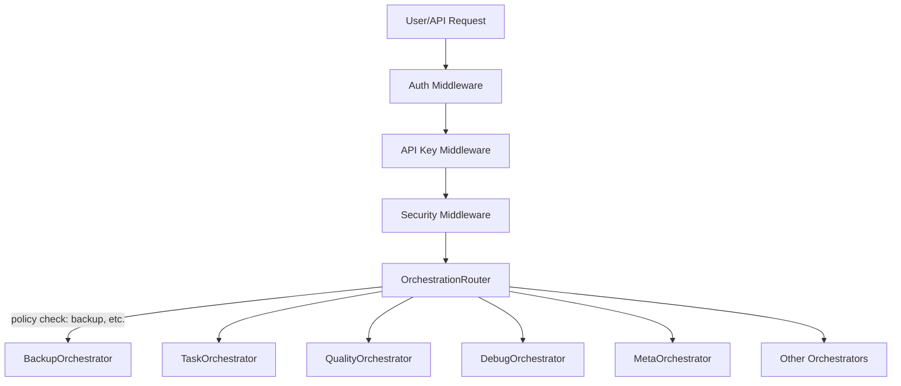
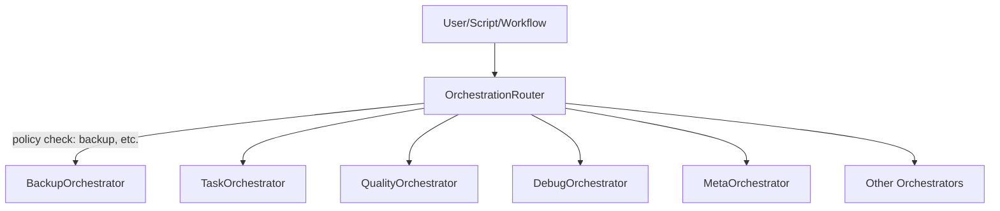

# OrchestrationRouter (CLARITY_ENGINE)

## Overview
The OrchestrationRouter is the canonical entry point for all orchestrator flows. It routes workflows and tasks to the appropriate orchestrator, enforces backup and compliance policies, and centralizes event routing, logging, and telemetry.

## Responsibilities
- Route all workflow and task requests to the correct orchestrator (Meta, Task, Quality, Debug, etc.)
- Enforce backup compliance by requiring BackupOrchestrator approval before any operation that could alter system state
- Centralize event routing for logging, telemetry, and policy enforcement
- Support extensibility for new orchestrators and workflows

## API
- `initialize()`
- `executeWorkflow(workflowName, params)`
- `getOrchestrator(name)`
- `handleOrchestratorError(name, error)`
- `handleOrchestratorComplete(name, result)`

## Backup Enforcement
- BackupOrchestrator is injected and initialized first
- Before routing any workflow or task that could alter system state, OrchestrationRouter calls `ensureSafeBackup()`
- If backup is not valid, the router halts the workflow and escalates

## Event Routing
- All orchestrator events (start, complete, error) are routed through OrchestrationRouter for centralized logging and telemetry
- LogOrchestrator and DebugOrchestrator are integrated for event aggregation and error handling

## Middleware Layer

The Middleware Layer is the first entrypoint for all API and system requests. It handles authentication, API key validation, security, audit logging, and context injection before any request reaches the orchestration layer.

- **Auth Middleware**: Authenticates and authorizes users and projects.
- **API Key Middleware**: Validates API keys and enforces access control.
- **Security Middleware**: Logs all access and security events, enforces security headers, and monitors for suspicious activity.
- **Context Injection**: Adds user, project, and security context to all orchestrator workflows.

All middleware events are logged to LogOrchestrator, SecurityManager, and/or the conversation log for full auditability.

See `middleware/auth-middleware.js`, `middleware/auth.js`, `middleware/security-middleware.js`, and related standards docs for details.

### Full System Flow


## Usage Example
```js
const OrchestrationRouter = require('scripts/core/orchestration-router');
const router = new OrchestrationRouter(options);
await router.initialize();
await router.executeWorkflow('documentation', { ...params });
```

## Architecture
```
[User/Script/Workflow]
        |
        v
[OrchestrationRouter] ---(policy check: backup, etc.)---> [BackupOrchestrator]
        |
        +--> [TaskOrchestrator]
        +--> [QualityOrchestrator]
        +--> [DebugOrchestrator]
        +--> [MetaOrchestrator]
        +--> [Other Orchestrators]
```

### Mermaid Diagram


## Compliance
- OrchestrationRouter enforces all standards in `/docs/standards/backup-standards.md`
- All orchestrator and automation flows must go through the router for compliance and auditability 