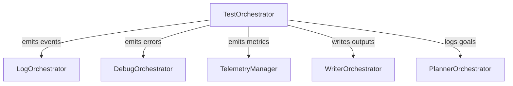

# TestOrchestrator

## Overview
The TestOrchestrator is a first-class orchestrator responsible for running E2E, integration, and unit tests in the CLARITY_ENGINE system. It emits all test events (start, pass, fail, error, summary) as structured events, routes all logs and results through the orchestration layer, and ensures all test outcomes are logged, summarized, and tracked as goals.

## Key Features
- Emits all test events as structured logs (no ad-hoc console.log)
- Routes logs, errors, and results through LogOrchestrator, DebugOrchestrator, TelemetryManager, WriterOrchestrator, and PlannerOrchestrator
- Writes all test outputs and summaries via WriterOrchestrator
- Logs all test goals and failures in PlannerOrchestrator
- Fully event-driven and orchestration-native

## Usage Example
```js
const TestOrchestrator = require('./core/test-orchestrator');
const testCases = [
  { name: 'should add numbers', description: 'Adds two numbers', fn: async () => { if (1 + 1 !== 2) throw new Error('Math fail'); } },
  { name: 'should throw error', description: 'Throws error', fn: async () => { throw new Error('Intentional fail'); } }
];
const testOrchestrator = new TestOrchestrator({/* options */}, { logger, debugOrchestrator, telemetryManager, writerOrchestrator, plannerOrchestrator });
testOrchestrator.runTests(testCases);
```

## Event Flow Diagram


## Integration Points
- **LogOrchestrator**: Receives all test logs
- **DebugOrchestrator**: Receives all test errors
- **TelemetryManager**: Receives all test metrics
- **WriterOrchestrator**: Writes all test outputs and summaries
- **PlannerOrchestrator**: Tracks all test goals and failures

## Troubleshooting
- Ensure all orchestrators are initialized and passed to TestOrchestrator
- Check WriterOrchestrator and PlannerOrchestrator outputs for test results and failures
- Use TelemetryManager for metrics and performance analysis

## FAQ
**Q: How do I add a new test?**
A: Add a new object to the `testCases` array with a `name`, `description`, and async `fn`.

**Q: Where do I find test results?**
A: In the WriterOrchestrator outputs (logs.md, summaries.md) and PlannerOrchestrator logs (main_task_log.md).

**Q: How are errors handled?**
A: All errors are routed through DebugOrchestrator and logged as failed goals in PlannerOrchestrator.

## See Also
- [LogOrchestrator](./LOG_ORCHESTRATOR.md)
- [DebugOrchestrator](./DEBUG_ORCHESTRATOR.md)
- [TelemetryManager](./TELEMETRY_MANAGER.md)
- [WriterOrchestrator](./WRITER_ORCHESTRATOR.md)
- [PlannerOrchestrator](./PLANNER_ORCHESTRATOR.md)
- [E2E Test Suite](../testing/TEST_SUITE_ORCHESTRATION.md) 