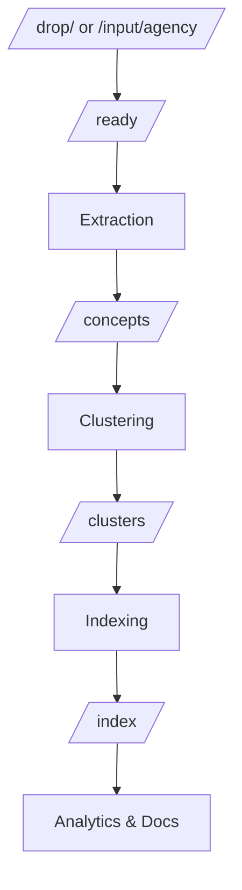

# Pipeline Contract

## Overview
This document defines the contract, boundaries, and anti-recursion guarantees for the CLARITY_ENGINE knowledge processing pipeline.

## Pipeline Stages
1. **Intake**: Watches `/drop/` or `/input/agency/` for new files, moves to `/ready/`.
2. **Extraction**: Processes `/ready/` files, extracts concepts, outputs to `/concepts/`.
3. **Clustering**: Groups concepts from `/concepts/`, outputs to `/clusters/`.
4. **Indexing**: Indexes clusters, outputs to `/index/`.
5. **Analytics & Docs**: Generates analytics, reports, and living documentation.

## Input/Output Contracts
- Each stage reads from a dedicated input and writes to a new output directory or file.
- No stage writes to its own input or re-triggers itself.
- Processed files are marked with `.done` or moved to `/processed/`.
- All outputs are versioned and append-only.

## Anti-Recursion Guarantees
- No script or daemon ever writes to its own input or triggers itself or upstream stages.
- All triggers are explicit (user, cron, or event from a different layer).
- Event logs are append-only and not used as triggers.
- Validation scripts check for cycles in data and process dependencies.

## Data Flow Diagram (Mermaid)

## Change Management
- All changes to this contract must be reviewed and versioned. 