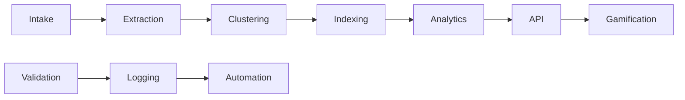

# System Architecture

## Overview
This document describes the high-level architecture of the CLARITY_ENGINE knowledge system, including major modules and their boundaries.

## Major Modules
- Intake Daemon
- Extraction Engine
- Clustering Engine
- Indexing Engine
- LLM Bulkhead
- Validation & Compliance
- Logging & Eventing
- API Server
- Gamification & Analytics
- Automation (Pre-commit, CI, Backup, Rollback)

## Module Boundaries
- Each module has a clear input/output contract and does not modify its own input.
- Communication between modules is via versioned artifacts and append-only logs.

## Data Flow Diagram (Mermaid)

## Change Management
- All changes to the architecture must be documented and versioned. 